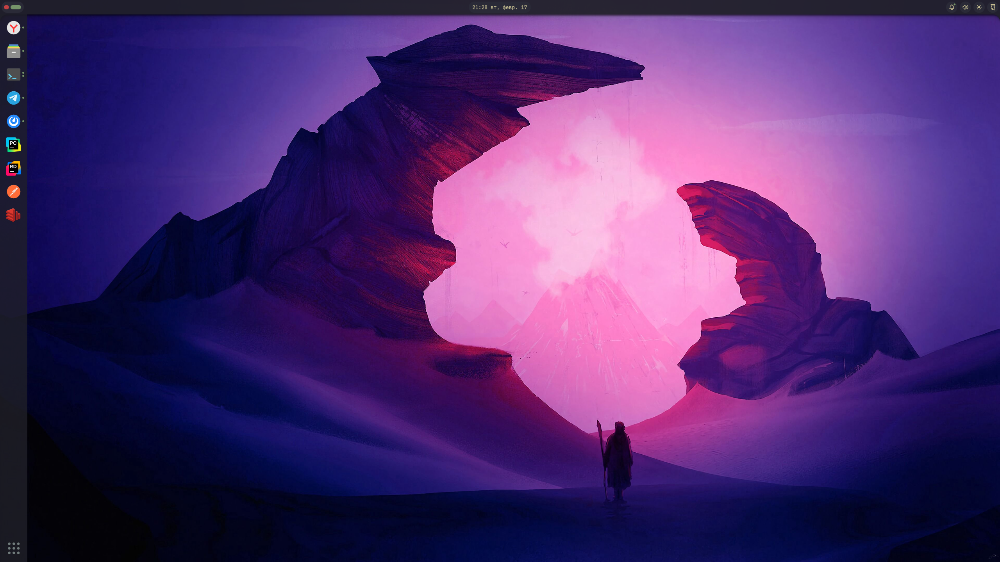

# noctalia-dock-plugin

A vertical dock plugin for Noctalia shell with pinned apps synced from the launcher. Inspired by [Dash to Dock](https://github.com/micheleg/dash-to-dock) and the [Ubuntu Desktop](https://ubuntu.com/desktop) dock UX.

## Screenshot



## Compatibility

- Shell project: [noctalia-shell](https://github.com/noctalia-dev/noctalia-shell)
- Plugin id: `noctalia-dock-plugin`
- Plugin name: `Noctalia Dock (Dash to Dock style)`
- Current version: `1.0.1`
- Minimum Noctalia Shell version: `4.5.0`
- Versioning: [Semantic Versioning](https://semver.org/) (`MAJOR.MINOR.PATCH`)
- Entry points: `Main.qml`, `Settings.qml`

## Installation

### Option 1: Install from local clone

1. Clone this repository:

```bash
git clone https://github.com/DFSko/noctalia-dock-plugin.git
```

2. Copy the plugin directory to your Noctalia plugins path:

```bash
mkdir -p ~/.config/noctalia/plugins
cp -r noctalia-dock-plugin ~/.config/noctalia/plugins/noctalia-dock-plugin
```

3. Restart `noctalia-shell` (or relogin) so the plugin is loaded.
4. Open Noctalia plugin settings and enable `noctalia-dock-plugin`.

### Option 2: Install via repository URL in Noctalia Control Center

1. Open Noctalia Control Center.
2. Go to `Plugins` -> `Sources`.
3. Add this repository URL as a plugin source:

```text
https://github.com/DFSko/noctalia-dock-plugin
```

4. Refresh sources, install `noctalia-dock-plugin`, then enable it in plugin settings.

## Releases

- The plugin version is defined in `manifest.json` (`version` field).
- Use patch releases (`x.y.Z`) for fixes/docs, minor releases (`x.Y.0`) for new features, and major releases (`X.0.0`) for breaking changes.
- See release history in [`CHANGELOG.md`](CHANGELOG.md).

## Features

- Left-side vertical dock with exclusive panel space
- Pinned apps are sourced from `Settings.data.appLauncher.pinnedApps`
- Click to focus an existing window or launch the app
- Running applications indicator on dock items
- Drag and drop to reorder pinned apps
- Launcher button at the bottom of the dock
- Scroll on dock background to switch workspaces via `CompositorService.switchToWorkspace`
- Notification shake animation on dock icons when apps receive notifications
- Uses shell launcher behavior (`customLaunchPrefix`, `app2unit`, terminal command fallback)

## Settings

Available in plugin settings:

- Enable dock
- Icon size
- Spacing between buttons
- Icon inset
- Background opacity
- Workspace switch on scroll

## Notes

- Pin and unpin apps from the launcher UI; the dock reflects that list automatically.
- Reordering in the dock updates launcher pinned order.
